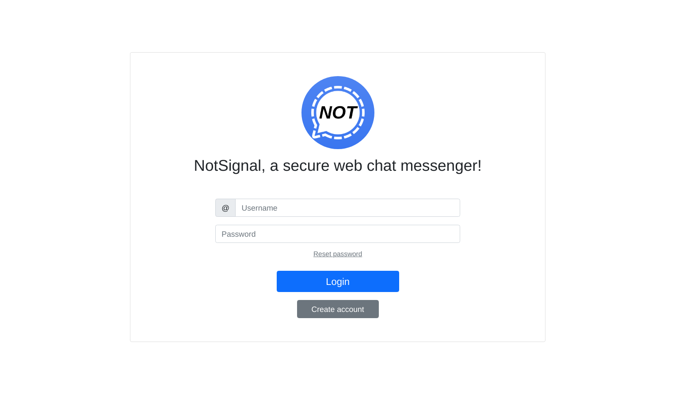
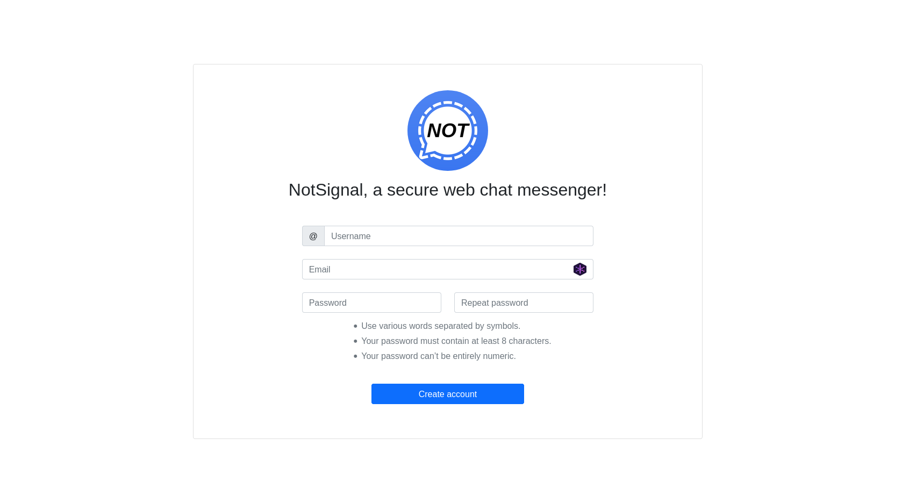
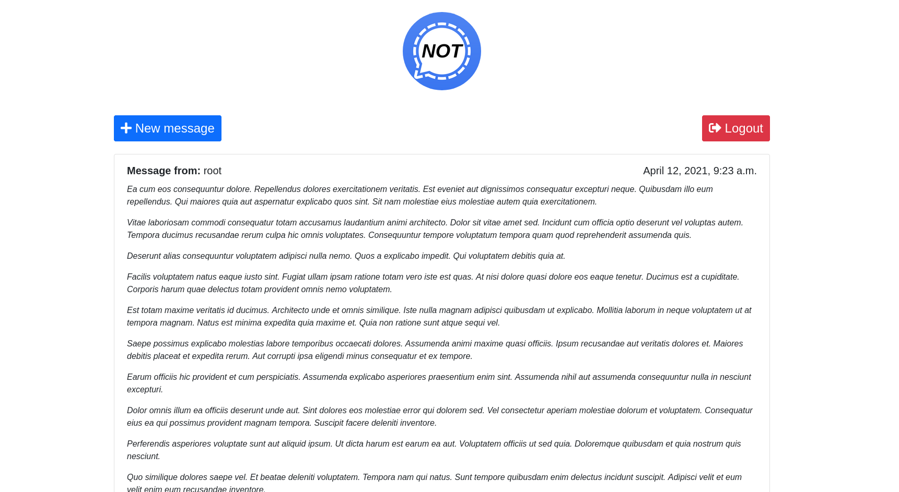

# NotSignal, a secure web chat messenger!
#### Capstone project of the 4 course specialization by the University of Maryland.

# Overview
Message content is encrypted at rest with SHA-512.

Login page

Signup page

Inbox

Sending messages

# Building and testing

## Requirements
* Docker (have it running `systemctl start docker`)
* Docker-compose
* Python 3.6 (Django cryptography doesn't work correctly in 3.9 at this time)

## Development
Use `docker-compose.yml` for development, it uses the Django built in `runserver`. 

The application is already setup for development, whenever you launch Django, it will automagically create the `db.sqlite3` file in the root of the Django app.

Once the server is up and running, we need to create the database, Django makes it easy. Just run the migrations:

`sudo docker-compose exec notsignal python manage.py migrate`

Now create a superuser:

`sudo docker-compose exec notsignal python manage.py createsuperuser`

## FAQ
* I f*cked up! How do I remove everything inside the containers? Check the containers ID with `sudo docker ps -a` and delete them with `sudo docker stop IDhere otherID`. Then proceed to nuke everything inside of Docker (WARNING THIS WILL REMOVE ALL CONTAINERS AND DATA) with `sudo docker system prune -a`. Yes this has happened to me so much that I needed to do a FAQ to remember it.

